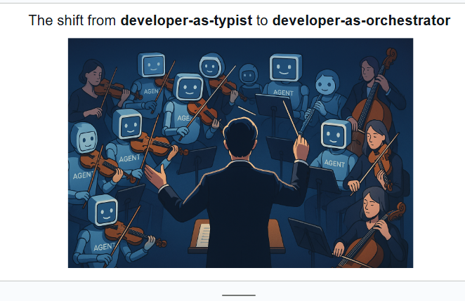

## Developer Ka Role Badal Gaya Hai

**Pehle: Developer-as-Typist (Code Likhne Wala)**
- Har line khud likhni parti thi
- Ek banda, ek kaam
- Slow aur limited output
- Manual coding = time-consuming

**Ab: Developer-as-Orchestrator (Conductor/Nikalna Wala)**
- Developer ab **orchestra conductor** ki tarah hai
- Multiple AI agents ko direct karta hai
- Sab agents saath mein kaam karte hain
- Output 10x-100x zyada

## Orchestra Analogy (Tashrih):

Image mein dekho:
- **Conductor (Developer)** = Beech mein khara hai, sab ko direct kar raha hai
- **Musicians (AI Agents)** = Violin, cello, instruments bajane wale
- **Harmony** = Sab mil kar ek saath perfect kaam

Yani:
- Pehle: Aap khud har instrument bajate the (slow, mushkil)
- Ab: Aap conductor ho, agents ko bolo aur wo perfectly execute karein (fast, efficient)

## Key Benefits:

**1. Productivity Explosion:**
- Ek developer = 10-100 agents ko manage
- Kaam bohot tezi se hota hai

**2. Focus Shift:**
- Code likhna nahi, **strategy sochna**
- Implementation agents karte hain
- Aap high-level decisions lete ho

**3. Scalability:**
- Ek insaan ki limitations nahi
- Jitne agents chahiye, utne deploy karo

## Real Example:
- **Pehle:** 1 developer = 1 feature in 1 week
- **Ab:** 1 orchestrator = 10 features in 1 week (agents se)

**Ye Digital FTE (Full-Time Equivalent) ka concept hai** - AI agents insaanon jaise full-time kaam karte hain!
