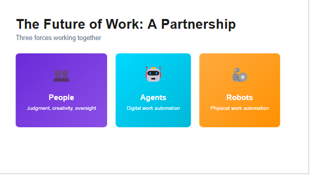

## Kaam Ka Mustaqbil: Teen Taaqatein Mil Kar Kaam Karengi

Is slide mein **3 forces** dikhaye gaye hain jo mil kar kaam karenge:

---

### 1️⃣ **PEOPLE (Insaan) - Purple Box**
**Role:** Judgment, Creativity, Oversight

**Kya Karenge:**
- **Strategic decisions** lena
- Creative thinking
- Oversight aur supervision
- High-level judgment calls
- Human touch jahan zaroori ho

**Example:**
- Business strategy banana
- Client relationships
- Creative campaigns design karna
- Ethical decisions lena

---

### 2️⃣ **AGENTS (AI Agents) - Blue Box**
**Role:** Digital Work Automation

**Kya Karenge:**
- **Digital tasks** automatically
- Data analysis
- Code likhna
- Reports banana
- Research karna
- Customer support (chatbots)

**Example:**
- Email responses likhna
- Sales leads qualify karna
- Code debugging
- Market research
- Document drafting

**Ye Digital FTEs hain** - 24/7 kaam karte hain!

---

### 3️⃣ **ROBOTS (Physical Robots) - Orange Box**
**Role:** Physical Work Automation

**Kya Karenge:**
- **Physical tasks** automatically
- Manufacturing
- Warehouse operations
- Delivery
- Assembly line work

**Example:**
- Amazon warehouses mein boxes uthana
- Car factory mein welding
- Food delivery robots
- Surgery assistance

---

## Book Se Key Point:

**"Three Forces Working Together"** ka matlab:

**Pehle ka tareeqa:**
```
Insaan → Sab kuch khud karta tha (slow, limited)
```

**Naya tareeqa (Partnership Model):**
```
People → Strategy + Creativity (high-value work)
   ↓
Agents → Digital automation (knowledge work)
   ↓
Robots → Physical automation (manual work)
```

---

## Real-World Example:

**E-commerce Company:**
- **People:** Marketing strategy banate hain, customer relationships
- **Agents:** Inventory management, customer support chats, data analysis
- **Robots:** Warehouse mein products pick & pack karte hain

**Result:** 
- 10x productivity
- Humans creative kaam karte hain
- Boring repetitive kaam agents/robots karte hain

---

## Book Ka Main Message:

> **"Humans won't be replaced - they'll be AUGMENTED"**

- Insaan phir bhi zaroori hain (judgment + creativity)
- Agents digital kaam sambhalte hain
- Robots physical kaam karte hain
- **Teeno mil kar PARTNERSHIP** banti hai

Ye **Agent Factory** ka vision hai - Digital FTEs banana jo insaanon ke saath kaam karein!
