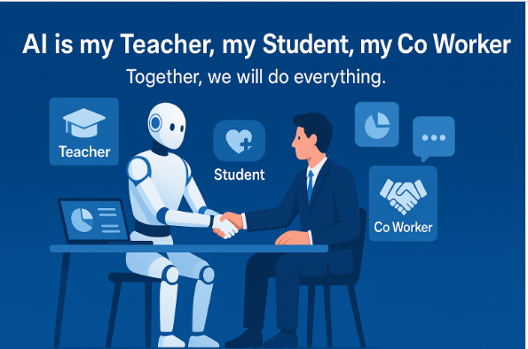

## AI Ke Teen Roles: Teacher, Student, Co-Worker

**"Together, we will do everything."** ← Ye tagline zaroori hai!

---

### 1️⃣ **AI as TEACHER (Ustad)**
🎓 **Kya Karta Hai:**
- Aapko seekhata hai
- Training deta hai
- Guidance provide karta hai
- Questions ka jawab deta hai

**Real Examples:**
- ChatGPT se coding seekhna
- AI tutors jo subjects samjhate hain
- Personalized learning paths
- "Claude, ye concept samjhao"

**Book Se Point:**
- AI infinite patience rakhta hai
- 24/7 available
- Har level pe seekha sakta hai

---

### 2️⃣ **AI as STUDENT (Shagird)**
❤️ **Kya Karta Hai:**
- Aap se seekhta hai
- Training leta hai
- Aapki company ka data samajhta hai
- Custom agents bante hain

**Real Examples:**
- Aap apne business rules sikhate ho
- Company policies train karte ho
- Domain expertise transfer karte ho
- "Ye hamare process hain, seekh lo"

**Book Se Point:**
- **Custom Agents** yahan bante hain
- General AI → Custom AI (your business ke liye)
- MCP servers se skills seekhta hai

---

### 3️⃣ **AI as CO-WORKER (Saathi)**
🤝 **Kya Karta Hai:**
- Aapke saath kaam karta hai
- Team member ki tarah
- Tasks share karta hai
- Collaboration karta hai

**Real Examples:**
- Code review karna
- Documents draft karna
- Research help karna
- Meeting notes lena
- **Digital FTE ki tarah 24/7 kaam**

**Book Se Point:**
- Ye **Agent Factory ka core vision** hai
- AI = Full-time employee replacement nahi, augmentation
- Human + AI partnership

---

## Image Ki Tafseel:

Dekho image mein:
- **Insaan aur AI robot handshake** kar rahe hain (partnership)
- Icons show karte hain teeno roles
- Laptop pe kaam chal raha hai (collaboration)

---

## Book Ka Main Concept:

### **"Together, we will do everything"**

**Matlab:**

```
Pehle: Insaan akela sab kuch karta tha
Ab: AI + Insaan = Powerful Team

AI as Teacher → Skills transfer
AI as Student → Custom training  
AI as Co-Worker → Daily collaboration
```

---

## Real-World Scenario:

**Developer Ki Daily Life:**

**Morning:**
- AI **teacher** ban kar new framework samjhata hai

**Afternoon:**  
- Developer AI ko company codebase **student** ki tarah train karta hai

**Evening:**
- AI **co-worker** ban kar code review aur bug fixes help karta hai

**Result:** Productivity 10x!

---

## Book Se Critical Point:

> **"AI replaces tasks, not people"**

- Boring tasks AI karta hai
- Creative decisions insaan karta hai
- **Partnership = Future of Work**

Ye exactly wahi hai jo **Agent Factory build kar raha hai** - Digital FTEs jo teeno roles play karein!
