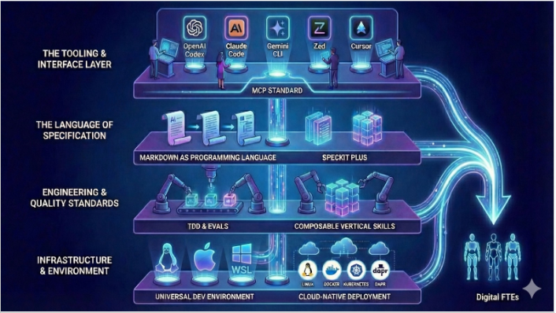

Yeh picture **Agent Factory** ke concept ko visually dikhati hai jo Panaversity ki book (ya guide) "The AI Agent Factory" mein preface section "Agent-Native" ke andar explain kiya gaya hai. Yeh ek layered architecture hai jo batati hai ke future mein software development **human-centric** se **agent-native** (AI agents pe based) kaise banega. Yani insaan code likhne ke bajaye sirf high-level specification dega aur AI agents khud pura system bana denge, test karenge, deploy karenge aur 24/7 chalenge — inhein **Digital FTEs** (Digital Full-Time Employees) kehte hain.

Ab layer by layer samjhte hain (top se bottom tak, jaise diagram mein hai):

1. **THE TOOLING & INTERFACE LAYER** (sab se ooper)  
   Yahan different AI tools aur interfaces hain jo developers abhi use karte hain jaise:  
   - OpenAI Codex  
   - Claude (Claude Code)  
   - Gemini  
   - Zed  
   - Cursor  
   Yeh sab AI-powered coding assistants hain. Inke neeche **MCP STANDARD** (Model Context Protocol) hai — yeh ek universal standard hai jo agents ko real business data (CRM, APIs etc.) se connect karta hai. Yani agents ko tools aur data mil sakein standardized tareeqe se.

2. **THE LANGUAGE OF SPECIFICATION**  
   Yahan **MARKDOWN AS PROGRAMMING LANGUAGE** likha hai. Matlab ab requirements ya specs normal Markdown mein likhi jayengi (jaise documentation), aur woh executable ban jayengi — AI unhein samajh ke code generate karega.  
   Saath mein **SPECKT PLUS** (shayad SPEC-KIT Plus ya similar) — yeh ek advanced specification format hai jo agents ke liye perfect hota hai.

3. **ENGINEERING & QUALITY STANDARDS**  
   Is layer mein quality ensure karne ke tools hain:  
   - **TDD & EVALS** (Test-Driven Development + Evaluations) — agents jo code banate hain unhein strict tests aur evals se guzarna padta hai (Golden Dataset pe 97%+ accuracy).  
   - **COMPOSABLE VERTICAL SKILLS** — yeh reusable domain-specific skills hain (maslan sales, finance, healthcare ke expert modules) jo building blocks ki tarah jod kar bade agents banaye ja sakte hain.

4. **INFRASTRUCTURE & ENVIRONMENT** (sab se neeche)  
   Yahan base environment hai:  
   - Linux, Apple, Windows, WSL  
   - **UNIVERSAL DEV ENVIRONMENT** (standardized Linux-based setup)  
   - Cloud providers (AWS, etc.), **CLOUD-NATIVE DEPLOYMENT** (Docker, Kubernetes waghera)  
   Sab kuch cloud pe scalable aur reliable tareeqe se deploy hota hai.

**Arrows ka flow** (jo curved arrows dikhte hain):  
Yeh top se bottom tak jata hai → yani high-level tools aur interface se shuru ho kar → specification → quality checks → infrastructure tak pahunchta hai. Aur end mein yeh sab mil kar **Digital FTEs** banate hain (AI agents jo full-time kaam karte hain jaise humans).

**Overall idea book ke mutabiq**:  
Ab developer "conductor" ban jata hai — woh bas music (requirements/spec in Markdown) batata hai, AI agents orchestra ki tarah bajaate hain (code likhte, test karte, deploy karte). Isse expertise 24/7 scale ho jati hai, businesses banane ka tareeqa badal jata hai, aur humans replace nahi hote balki unki capability bohot barh jati hai.