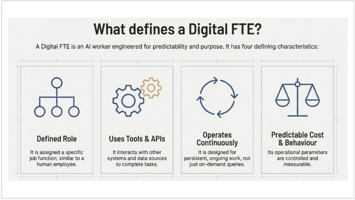

Yeh image **Agent Factory** book ke core vision ko visually represent karti hai, jo **Digital FTEs** (Digital Full-Time Equivalents) ke concept pe based hai. Book ke mutabiq, yeh vision hai ke hum **structured AI workers** banayein — yani specialized, purpose-built AI agents jo repeatable knowledge work (jaise sales lead qualification, compliance check, accounting tasks, finance reporting waghera) ko 24/7 perfectly perform karein, bilkul jaise ek full-time human employee kaam karta hai, lekin bohot behtar tareeqe se.

**Image ka breakdown Roman Urdu mein:**

- **Central hexagonal structure** (beech mein bara blue hexagon): Yeh core **Agent Factory** ya main orchestration hub ko dikhata hai — jahan se sab kuch control hota hai. Book mein yeh idea hai ke ek central system (jaise multi-agent coordination) agents ko manage karta hai, unhein tasks assign karta hai, aur unke outputs ko combine karta hai.

- **Aas-paas 8 octagonal/hexagonal modules** (solar-system ya flower jaise connected): Har module ek **specialized Digital FTE** ya **vertical skill** ko represent karta hai. Yani har ek AI worker specific function ke liye bana hai, maslan:
  - Ek sales agent (lead qualify karne wala)
  - Ek finance agent (reports banane wala)
  - Ek legal/compliance agent
  - Ek healthcare ya customer support wala
  Yeh sab **distinct from generic conversational AI** hain — yani yeh ChatGPT jaisa baat-cheet karne wala nahi, balki structured, reliable, aur task-specific hain. Book kehte hain: "These are structured AI workers, designed for specific functions, distinct from generic, conversational AI."

- **Wires aur connections** (lines jo sab ko jod rahi hain): Yeh **multi-agent orchestration** dikhati hain — yani agents ek dusre se communicate karte hain, data share karte hain, collaborate karte hain (jaise ek team). Book mein isey "orchestrated intelligence" kehte hain: human conductor ban jata hai, aur AI agents orchestra ki tarah kaam karte hain. Composable vertical skills (reusable domain expertise) ko jod kar bade systems banaye ja sakte hain.

- **Text overlay**:
  - "Our vision is to create Digital Full-Time Equivalents (Digital FTEs) that perform real, repeatable knowledge work."
  - "These are structured AI workers, designed for specific functions, distinct from generic, conversational AI."

**Book ke hisaab se overall meaning**:
Vision yeh hai ke domain experts (jaise sales wale, accountants, lawyers) apni expertise ko **encode** karein specifications (Markdown/Speck) mein, phir AI agents usey seekh kar autonomous ban jayein. Yeh agents:
- 168 hours/week kaam karte hain (human se 4x zyada)
- Cost bohot kam ($500-2000/month vs human $4000-8000+)
- 99%+ consistent aur scalable (clone kar sakte ho)
- Repeatable tasks ko perfectly handle karte hain (jaise overnight monitoring, lead follow-up)
- Monetize kiye ja sakte hain (subscription, license, marketplace pe sell)

Yeh diagram is vision ka blueprint hai: ek interconnected network of specialized AI workers jo ek dusre ke saath mil kar real business value create karte hain, generic chatbots se bilkul alag. Book ka focus hai ke yeh agents build karna seekho (spec-driven, TDD, MCP integration, cloud deployment), taake expertise ko digital product mein badal sako jo 24/7 revenue generate kare.