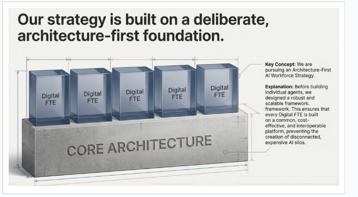

Yeh image aur concept **Agent Factory** (Panaversity ke book se) ka hai, jo bohot simple Roman Urdu mein samjhaata hoon:

Pehle yeh samjho ki hum AI agents ko **Digital FTE** kehte hain.  
**FTE** ka matlab hai **Full-Time Equivalent** — yani ek poora full-time employee jaisa kaam karne wala AI worker.

**Digital FTE** = Ek aisa AI jo insaan ki tarah kaam karta hai, lekin yeh 24/7 chalta rehta hai (168 ghante hafte mein), chhutti nahi leta, thakta nahi, aur ek hi time pe bohot saare kaam handle kar sakta hai.

Ab strategy yeh hai: **Architecture-First** approach (pehle architecture banao, phir agents banao)

Yani hum seedha seedha alag alag individual AI agents nahi banate.  
Uske bajaye pehle ek **mazboot, common foundation** (core architecture) banate hain — jaise building ki neev bohot strong hoti hai.

Is core architecture pe phir saare **Digital FTE** (AI agents) khade kiye jaate hain.

Jaise image mein dikhaaya hai:

- Neeche ek bari **solid base** hai → **CORE ARCHITECTURE** (yeh common framework hai — rules, tools, protocols, standards jaise MCP, Nine Pillars waghera)

- Us base ke ooper 5 transparent cubes (digital blocks) khade hain → Har cube ek **Digital FTE** hai (alag alag kaam karne wala AI agent)

Yeh cubes ek doosre se connected hain, ek hi base pe khade hain, is liye yeh sab **interoperable** hain (ek doosre se baat kar sakte hain), cost-effective hain, aur future mein scale karna asaan hai.

**Galat tareeqa** (jo bohot log karte hain):  
Har agent ko alag se banao → har ek ka apna alag system, alag data connection, alag tools → yeh sab **disconnected silos** ban jaate hain (jaise alag alag chhote chhote makaan bina road ke). Mahanga padta hai, maintain karna mushkil, aur baad mein judna mushkil.

**Sahih tareeqa** (jo book sikhati hai):  
Pehle **common core architecture** banao (jaise ek bara strong platform)  
Phir har Digital FTE isi platform pe build karo → sab agents ek doosre se juday hue, sasta, tez scale hone wala, aur professional product ban jaata hai.

**Simple misaal**:  
Socho ghar banane ka — agar pehle pura mohalla ka plumbing, bijli, road ka system strong bana lo, phir har ghar banao → sab ghar ache connected, saste aur reliable honge.  
Agar har ghar ke liye alag borewell, alag bijli pole khade karo → bohot mehnga aur mess ho jaayega.

Yeh hi **Architecture-First** strategy hai: **Pehle foundation mazboot karo, phir uspe Digital AI workforce (Digital FTEs) khade karo.**  
Is se disconnected AI silos nahi bante, balki ek unified, powerful, aur paisa kamane wala AI workforce ban jaata hai.

Yeh book ka core idea hai — agents ko sirf tool nahi, balki proper **product** aur **workforce** ki tarah treat karo, architecture pe focus karke.