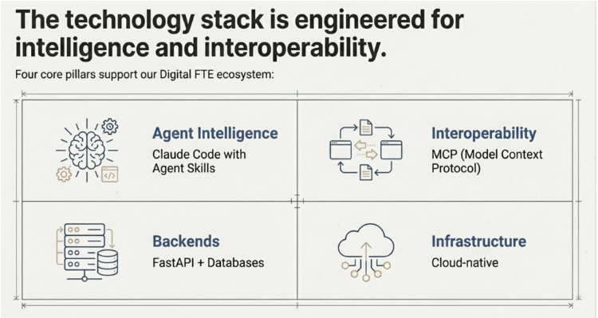

Agent Factory book ke mutabiq, yeh image **Digital FTE ecosystem ko support karne wali four core pillars** ko dikhati hai—yeh woh technological foundation hai jo AI agents banane aur bechne ke liye zaroori hai jo "Digital Full-Time Equivalents" ki tarah kaam karte hain.

Har pillar book ke framework se kaise connect hota hai:
## **1. Agent Intelligence - Claude Code with Agent Skills**

Yeh **Path A: General Agents** ko represent karta hai book se. Claude Code sirf ek coding tool nahi hai—yeh ek reasoning system hai jo problems ko observe karta hai, constraints ke around orient hota hai, approaches par decide karta hai, code execution ke zariye act karta hai, aur apni mistakes khud correct karta hai. "Agent Skills" se murad woh composable domain expertise hai jo aap `SKILL.md` files mein encode karte hain, jo portable aur monetizable assets ban jaati hain. Yeh pillar aapko General Agents ko factory ki tarah use karke Custom Agents manufacture karne ki ability deta hai.

## **2. Interoperability - MCP (Model Context Protocol)**

MCP **Nine Pillars of AI-Native Development** mein se ek hai aur poori book mein critical infrastructure ke taur par repeatedly aata hai. Yeh woh universal standard hai jo aapke agents ko real business data se connect karta hai—CRM systems, databases, APIs, aur internal tools. MCP integration ke bagair, aapke Digital FTEs isolated demos hi rahenge rather than production systems jo customer data access kar sakein, transactions execute kar sakein, aur existing business workflows ke saath integrate ho sakein.

## **3. Backends - FastAPI + Databases**

Yeh sellable Custom Agents banane ke liye technical infrastructure layer ko represent karta hai. Book emphasize karti hai ke Digital FTEs **production-ready products** hone chahiye, toys nahi. FastAPI agent interactions ke liye API layer provide karta hai, jabke databases woh state, conversation history, aur domain knowledge store karte hain jo agents ko reliable aur consistent banate hain. Yeh pillar experimental agents se enterprise-grade systems ki taraf transition ko support karta hai jo hazaron customer interactions handle kar sakein.

## **4. Infrastructure - Cloud-native**

Yeh directly book ki roadmap ke **Parts 10-13** se map hota hai jo deployment aur scaling par focused hain. Cloud-native infrastructure (Docker, Kubernetes, Dapr) aapko aise Digital FTEs deploy karne ki ability deta hai jo 24/7 bina manual intervention ke kaam karein, customers multiply hone par instantly scale ho sakein, aur enterprise-level reliability ke saath operate karein. Yeh pillar aapke local agent prototype ko ek aise product mein transform karta hai jo aap actually subscriptions, licenses, ya marketplace distribution ke zariye bech sakte hain.

## **The Big Picture**

Yeh charon pillars mil kar woh cheez create karte hain jise book **"Agent Factory"** kehti hai—aapki woh ability ke aap systematically domain expertise ko sellable Digital FTEs mein transform kar sakein. Aap Agent Intelligence ko build karne ke liye use karte hain, MCP ko connect karne ke liye, Backends ko operationalize karne ke liye, aur Infrastructure ko scale karne ke liye. Image dikhati hai ke revenue-generating AI products banana chahte hain toh charon pillars mein mastery zaroori hai, sirf "AI ko prompt karna" kaafi nahi.