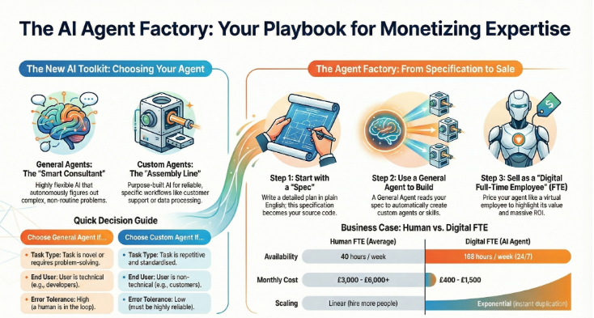

## **Left Side: The New AI Toolkit - Choosing Your Agent**

### **General Agents: "The Smart Consultant"**
- **Examples:** Claude Code, Gemini CLI, Goose
- Bahut flexible, kisi bhi problem ko solve kar sakte hain
- Yeh **reasoning systems** hain jo khud sochte hain aur code likhte hain
- Aap inhe **Director** ki tarah use karte hain - sirf batao kya chahiye, yeh figure out kar lenge

**Kab use karein:**
- Novel/naye problems ke liye
- Complex debugging ke liye
- Custom Agents banana hai toh

### **Custom Agents: "The Execution Line"**
- **Examples:** OpenAI SDK, Claude SDK
- Ek specific task ke liye specialized
- Kam flexible lekin zyada reliable
- Customers ko bechne ke liye ready product

**Kab use karein:**
- Standardized workflows ke liye
- Customer-facing products banana hai
- High-volume automation chahiye

### **Quick Decision Guide:**
- **General Agent** choose karo agar task naya hai ya problem-solving chahiye
- **Custom Agent** choose karo agar repetitive task hai aur customers ko bechna hai

## **Right Side: The Agent Factory Process**

### **Step 1: Start with a "Spec"**
- Pehle detailed plan likhte hain (specification)
- English mein clear instructions jo "contract" ban jata hai
- Book kehti hai: **"Specifications as Living Contracts"**

### **Step 2: Use a General Agent to Build**
- General Agent (Claude Code) aapki spec read karta hai
- Automatically custom agents ya skills bana deta hai
- Yeh **Agent Factory** ka core concept hai

### **Step 3: Sell as a "Digital Full-Time Employee" (FTE)**
- Ab aapka agent ek product ban gaya
- Package karke companies ko becho
- Recurring income milti rahegi

## **Business Case: Human vs. Digital FTE**

Book ka main point yahan dikhai deta hai:

**Human FTE:**
- **Availability:** 40 hours/week
- **Monthly Cost:** £3,000 - £6,000+
- **Scaling:** Linear (10 log chahiye = 10 hire karo)

**Digital FTE:**
- **Availability:** 168 hours/week (24/7)
- **Monthly Cost:** £400 - £1,500
- **Scaling:** Exponential (instant clone ho jata hai)

## **Simple Summary:**

1. **General Agents** (Claude Code) = Factory hai
2. **Specification** likho = Blueprint hai
3. **Custom Agent** ban gaya = Product hai
4. **Digital FTE** becho = Business hai

Book ka message: Aap apni expertise ko General Agent ko sikha do, woh Custom Agent bana dega, aur aap usko **monthly subscription** pe bech sakte ho. Human employee se sasta aur 24/7 kaam karta hai!