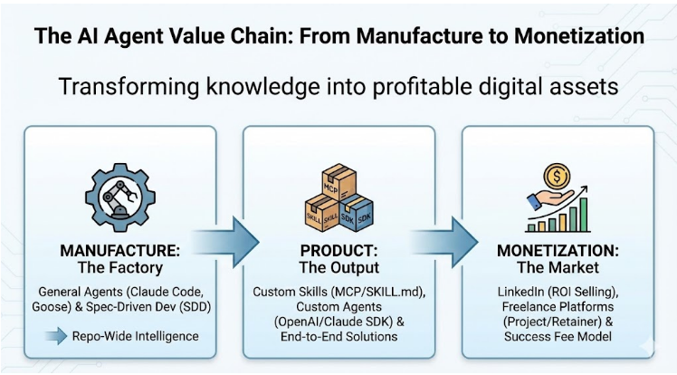

## **Stage 1: MANUFACTURE - The Factory**

**Tools:**
- **General Agents:** Claude Code, Gemini CLI, Goose
- **Spec-Driven Development (SDD):** Specifications likhna

**Kya hota hai:**
- Yeh aapki **manufacturing facility** hai
- Aap specifications likhte ho
- General Agents automatically agents banate hain
- **"Repo-Wide Intelligence"** matlab poora project samajhte hain

**Book ka concept:** General Agents = Agent Factory. Yeh aapke liye workers ki tarah Custom Agents manufacture karte hain.

## **Stage 2: PRODUCT - The Output**

**Output:**
- **Custom Skills:** MCP/SKILL.md files (portable expertise)
- **Custom Agents:** OpenAI/Claude SDK use karke banaye gaye
- **End-to-End Solutions:** Complete working products

**Kya hota hai:**
- Manufacturing se **packaged product** ban gaya
- Yeh ab customers ko de sakte hain
- Specific workflows ke liye optimized
- Reliable aur production-ready

**Book ka concept:** Yeh woh Digital FTEs hain jo aap bechoge. Stage 1 mein banaye, Stage 2 mein package kiye.

## **Stage 3: MONETIZATION - The Market**

**Revenue Models (Book ke 4 Ways):**

1. **LinkedIn (ROI Selling):** B2B marketing, enterprise clients ko dikhaao kaise ROI milega
2. **Freelance Platforms:** Upwork, Fiverr pe services becho
3. **Project/Retainer:** Monthly retainer fee lo clients se
4. **Success Fee Model:** Results ke basis pe commission lo

**Book mein mention:**
- **Subscription:** $500-2,000/month per Digital FTE
- **License:** Enterprises ko yearly fee pe dena
- **Marketplace:** OpenAI Apps store pe bechna
- **Success Fee:** Results pe percentage lena

## **The Complete Value Chain (Book ka Main Point):**

```
KNOWLEDGE → MANUFACTURE → PRODUCT → MONEY
   ↓              ↓              ↓         ↓
Your         General        Custom     Recurring
Expertise    Agents         Agents     Revenue
             Build It       Sell It    Earn It
```

## **Real Example (Book se):**

**Legal Expert:**
1. **Manufacture:** Claude Code ko bataya "contract review kaise karte hain"
2. **Product:** "Digital Legal Assistant" ban gaya (Custom Agent)
3. **Monetization:** Law firms ko $1,500/month pe becha

**Result:** CoCounsel ($650 million acquisition) - book ka example!

## **Simple Summary:**

Yeh 3-step process hai **knowledge ko cash mein convert karne ka:**

1. **Factory (Manufacture):** General Agents se Custom Agents banao
2. **Product:** Package karo production-ready solution
3. **Market:** Becho aur monthly income lo

Book kehti hai: "Transforming knowledge into profitable digital assets" - yeh wohi process hai!