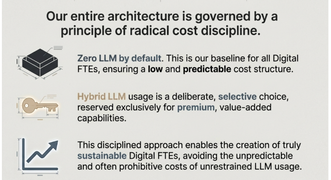

## Radical Cost Discipline - Digital FTE Success Ki Jaan

Yeh principle book ke **"Digital FTE Value Proposition"** section ka heart hai.

### 1. Zero LLM by Default (Foundation Layer) 🔲

**"Low and predictable cost structure"**

Book mein jo **Digital FTE economics** explain kiye gaye hain, unka basis yahi hai:

**Traditional Human FTE:**
- Monthly cost: $4,000 - $8,000+
- Unpredictable (sick days, turnover, overtime)

**Digital FTE with Zero LLM baseline:**
- Monthly cost: $500 - $2,000
- **Predictable** kyunki LLM calls nahi, sirf infrastructure cost

**Book ka example - Digital SDR:**
- 1,000+ leads process karo daily
- Sirf deterministic logic use karo:
  - Email template select karo
  - CRM field update karo  
  - Workflow trigger karo
- **Cost per lead: $0.50** (vs $30-60 for human)

### 2. Hybrid LLM - The Key (Premium Unlock) 🔑

**"Deliberate, selective choice for premium capabilities"**

Yeh book ke **"Four Ways to Monetize"** strategy ko enable karta hai:

**Subscription Model Example:**
- **Basic Plan ($500/mo)**: Zero LLM, 1000 leads/month
- **Pro Plan ($1,500/mo)**: Hybrid backend unlocked
  - AI-powered lead scoring
  - Personalized email generation
  - Sentiment analysis

**The Math:**
- 95% operations → Zero LLM (almost free)
- 5% operations → LLM calls ($200 in API costs)
- **Your margin: $1,300** per customer per month!

### 3. Sustainable Growth (Long-term Success) 📈

**"Avoiding unpredictable and prohibitive costs"**

Book mein **"The Competitive Reality"** section yeh batata hai ke kyun yeh approach jitti hai:

**Unsustainable Approach (Competitors):**
```
Every task → LLM call
1000 tasks/day × $0.50/call = $500/day = $15,000/month
Customer paying: $2,000/month
Result: Losing $13,000/month ❌
```

**Sustainable Approach (Your Digital FTE):**
```
950 tasks → Zero LLM (nearly free)
50 tasks → LLM calls ($25/day) = $750/month
Infrastructure: $250/month
Total cost: $1,000/month
Customer paying: $2,000/month
Result: Profit $1,000/month ✅
```

### Book Ke Framework Mein Integration

Yeh principle **"Nine Pillars of AI-Native Development"** ke saath align hota hai:

**Pillar #6: Test-Driven Development**
- Zero LLM outputs = testable, predictable
- LLM outputs = variable, need careful evaluation

**Pillar #7: Spec-Driven Development**
- Specifications batate hain: "Yahan LLM chahiye ya nahi?"
- Default assumption: LLM nahi chahiye (until proven necessary)

### Real-World Application (Book Se)

**Digital Accountant Example:**

**Tasks breakdown:**
- Data entry, calculations, report generation → **Zero LLM** (90%)
- Complex tax scenarios interpretation → **Hybrid LLM** (5%)
- Client communication drafting → **Hybrid LLM** (5%)

**Result:**
- Reliable 24/7 service
- Profitable unit economics
- Scalable without bleeding money

### The "Aha!" Moment

Book mein jo **Digital FTE vs Human FTE comparison** table hai, uska secret yahi "radical cost discipline" hai:

**Why Digital FTEs work 168 hours but cost only $500-2000:**
- AI sirf "intelligence wale moments" mein use hota hai
- Baki sab deterministic automation hai
- This discipline = profitable business model

### Critical Business Insight

Image ke neeche jo graph hai woh represent karta hai:

**Sustainable = Long-term profitable**

Agar aap:
- Har task pe LLM lagate ho → Costs badhti rahti hain → Business fail hota hai
- Selective LLM use karte ho → Costs controlled rahti hain → Business scales

### Book Ka Core Message

**Part 10-13: Scale & Monetize** section mein yeh clearly bataya gaya hai:

> "The companies that adopt AI-native development NOW will dominate their markets."

Lekin dominate sirf woh karenge jo **sustainable economics** ke saath build karenge. Aur sustainable economics ka matlab hai: **Radical Cost Discipline**.

### Practical Takeaway

Jab aap apna Digital FTE design karo:

1. **Default mindset**: "Yeh task bina LLM ke ho sakta hai?"
2. **LLM justify karo**: "Premium feature hai? Customer iske liye extra pay karega?"
3. **Always measure**: LLM usage track karo, optimize karte raho

### The Competitive Moat

Book mein **"The $650 Million Proof Point"** (CoCounsel acquisition) mention hai. Unki success ka ek bara reason:

- **Smart architecture** jisme expensive AI sirf zaroori jagah use hua
- **Legal expertise** encode kiya deterministic rules mein jahan possible tha
- Result: **Profitable, scalable** product jo Thomson Reuters ne $650M mein kharida

---

**Bottom Line**: Yeh sirf cost-cutting nahi hai. Yeh **strategic discipline** hai jo decide karti hai ke aapka Digital FTE business **profitable hoga ya loss mein**. 

Book ka yeh principle aapko **Path A se Path B tak le jata hai** - General Agents se seekho, lekin Custom Agents **economically sound** banao! 💡💰