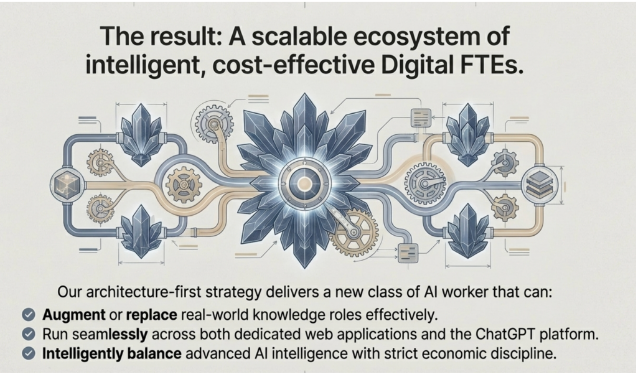

## Scalable Ecosystem of Digital FTEs - The End Game 🎯

Yeh image **book ka culmination** hai - jahan sabhi concepts (Zero LLM, Hybrid Backend, Cost Discipline) ek **production-ready ecosystem** ban jate hain.

### Image Ka Architecture Breakdown

**Center mein bara phool (gear)** = Core orchestration system
**Chote phool aur gears** = Individual Digital FTEs
**Connecting pipes** = MCP (Model Context Protocol) integrations
**Different symbols** = Different types of workers (Data, Documents, Communication)

Yeh represent karta hai book ke **Part 6-9: Agent Development** aur **Part 10-13: Scale & Monetize** sections.

---

## Three Core Capabilities (Image Mein Listed)

### 1. Augment or Replace Real-World Knowledge Roles ✅

**Book ka Digital FTE comparison table yaad hai?**

| Role | Human FTE Cost | Digital FTE Cost | Hours/Week |
|------|---------------|------------------|------------|
| SDR | $6,000/mo | $1,500/mo | 168 vs 40 |
| Accountant | $8,000/mo | $2,000/mo | 168 vs 40 |
| Legal Assistant | $5,000/mo | $1,200/mo | 168 vs 40 |

**"Augment or Replace"** ka matlab:

**Augment (Support karo):**
- Human SDR high-value deals pe focus kare
- Digital SDR routine follow-ups handle kare
- Result: Team productivity 5-10x badh jati hai

**Replace (Substitute karo):**
- Startup initially afford nahi kar sakta 3 SDRs hire karna
- 1 Digital SDR deploy karo $1,500/mo mein
- Scale hone ke baad human team add karo

**Book ka CoCounsel example yahi hai:**
- Legal research aur document review → Digital FTE effectively handle karta hai
- Senior lawyers strategic work pe focus kar sakte hain
- Result: $650M acquisition value

---

### 2. Run Seamlessly Across Platforms 🌐

**"Dedicated web applications AND ChatGPT platform"**

Book mein **distribution strategies** explain kiye gaye hain:

#### Path A: Custom Web Application (Your Own Platform)

**Example - Digital Accountant:**
```
your-accounting-fte.com
↓
Client logs in
↓
Upload receipts, invoices
↓
Digital FTE processes (Zero LLM)
↓
Complex tax questions (Hybrid LLM)
↓
Generate reports
```

**Your control:**
- Branding
- Pricing
- Features
- User data

#### Path B: OpenAI Apps Marketplace (Leverage Platform)

Book ke **"The Distribution Breakthrough"** section mein yeh golden opportunity bataya gaya hai:

- **800+ million users** already on platform
- **1+ million businesses** looking for solutions
- **Single-click adoption** - no procurement hassle
- **Zero marketing cost** initially

**Example:**
- "Legal Document Reviewer" agent banao
- OpenAI Apps marketplace pe list karo
- Law firms direct discover aur subscribe kar sakte hain

**Seamlessly run** ka matlab:
- Same Digital FTE logic
- Same MCP integrations
- Different front-ends
- **Reach multiply** ho jata hai

#### The Magic: Same Backend, Multiple Frontends

```
Digital SDR Core Logic (Gears in image)
         ↓
    ┌────┴────┐
    ↓         ↓
Your SaaS   ChatGPT App
Platform    Marketplace
```

---

### 3. Intelligently Balance Advanced AI & Strict Economic Discipline 💰

Yeh sabse **critical capability** hai - book ka **"Radical Cost Discipline"** principle in action.

**Image mein phool aur gears ka combination:**
- **Gears** = Deterministic, cheap, reliable (Zero LLM)
- **Phool** = Intelligence, nuance, premium (Hybrid LLM)

#### Real-World Balancing Act

**Digital Customer Support FTE Example:**

**Incoming ticket flow (1000 tickets/day):**

```
Step 1: Classify intent (Zero LLM - deterministic rules)
├─ Simple FAQ (800 tickets) → Template response (Zero LLM)
├─ Refund request (150 tickets) → Automated workflow (Zero LLM)
└─ Complex issue (50 tickets) → Hybrid LLM analysis

Cost breakdown:
- 950 tickets: Almost free (Zero LLM)
- 50 tickets: LLM calls (~$25/day)
Total: $750/month in LLM costs
Revenue: $2,000/month subscription
Profit: $1,250/month per customer
```

#### The Intelligence Layer (Book Se)

**Part 4-5: The Building Blocks** mein yeh sikhaया gaya hai:

**When to use LLM (Hybrid mode):**
- Nuanced decision making
- Context synthesis across sources
- Personalization beyond templates
- Complex data analysis

**When NOT to use LLM (Zero mode):**
- Data retrieval
- Calculations
- Rule-based decisions
- Template rendering
- CRM updates

#### Economic Discipline = Scalability

Book ke **"Scale & Monetize"** section ka core:

**Without discipline:**
```
Customer 1: $15,000 LLM costs/month
Customer 10: $150,000 LLM costs/month
Customer 100: $1.5M LLM costs/month
Revenue: $200,000/month
Result: BANKRUPT ❌
```

**With discipline:**
```
Customer 1: $750 LLM costs/month
Customer 10: $7,500 LLM costs/month
Customer 100: $75,000 LLM costs/month
Revenue: $200,000/month
Profit: $100,000+/month ✅
```

---

## The "Scalable Ecosystem" Vision

Image ka center piece (bara interconnected system) represent karta hai:

### Multi-Agent Orchestration (Book Part 6-9)

Ek company ke andar **multiple Digital FTEs work together:**

```
Digital SDR (Lead generation)
    ↓ (MCP connection)
Digital Sales Analyst (Scoring)
    ↓ (MCP connection)
Digital Account Manager (Onboarding)
    ↓ (MCP connection)
Digital Customer Success (Retention)
```

**Each agent:**
- Apna specific role (specialized gears)
- Intelligent jahan zaroorat (phool = LLM)
- Cost-effective overall (economic discipline)

### The Architecture-First Strategy

Book mein repeatedly emphasize kiya gaya hai:

**"Specification-first development"** → Architecture emerges from clear requirements

**This ecosystem achieves:**

1. **Modularity** - Har Digital FTE independently develop aur deploy
2. **Interoperability** - MCP standard se sab connect hote hain
3. **Scalability** - New FTEs add karo without rebuilding
4. **Maintainability** - Har component test aur update independently

---

## Business Model Integration

Yeh ecosystem **book ke monetization models** ko enable karta hai:

### Model 1: Subscription (Bundle)
```
Basic: 1 Digital FTE → $500/mo
Professional: 3 Digital FTEs → $1,200/mo
Enterprise: Unlimited FTEs → $5,000/mo
```

### Model 2: Per-FTE Licensing
```
Digital SDR → $800/mo
Digital Accountant → $1,500/mo
Digital Legal Assistant → $2,000/mo
```

### Model 3: Marketplace Distribution
```
Each FTE listed on OpenAI Apps
Individual pricing: $50-500/mo
Volume play: 1000s of customers
```

### Model 4: White-Label Platform
```
License entire ecosystem to enterprises
Annual contract: $50,000 - $500,000
They run on their infrastructure
```

---

## The Competitive Moat (Book Se)

**"The Competitive Reality"** section batata hai kyun yeh approach unbeatable hai:

### Your Advantages:

1. **Cost structure** - Competitors bleed money on LLM usage
2. **Reliability** - Zero LLM baseline = predictable performance
3. **Speed** - Ship new FTEs in weeks (not months)
4. **Intelligence** - Strategic LLM use jahan impactful
5. **Distribution** - Multiple channels (own + marketplaces)

### Competitors' Struggles:

- Over-reliance on LLMs → High costs → Unsustainable
- Lack of architecture → Monolithic → Hard to scale
- No economic discipline → Can't price competitively

---

## Real-World Path (Book Roadmap)

**How you get to this ecosystem:**

### Phase 1: Foundation (Parts 1-3)
- Learn specs, AI collaboration
- **Build 1 Digital FTE**

### Phase 2: Products (Parts 4-9)
- Master MCP, testing, agent SDKs
- **Build 3-5 specialized FTEs**

### Phase 3: Ecosystem (Parts 10-13)
- Deploy on cloud
- Connect FTEs via orchestration
- **Launch scalable platform**

---

## The Ultimate Vision

Image ka title: **"Intelligent, Cost-Effective Digital FTEs"**

Yeh dono cheezein saath mein:
- **Intelligent** without breaking the bank
- **Cost-effective** without sacrificing quality

**Book ka final message:**

> "This isn't just a new way to code. It's a new way to build businesses."

Yeh ecosystem woh business hai - jahan:
- Aapka **domain expertise** encoded hai (CoCounsel jaise)
- **AI strategically** use hota hai (Hybrid approach)
- **Economics sustainable** hain (Radical cost discipline)
- **Distribution automated** hai (Marketplace + Platform)

---

## Practical Takeaway 🎯

Jab aap apna Agent Factory banao:

1. **Start small**: 1 Digital FTE, 1 workflow
2. **Prove economics**: Profitability per customer
3. **Add strategically**: New FTEs jahan demand ho
4. **Connect intelligently**: MCP se ecosystem banao
5. **Scale confidently**: Cost discipline ensures margins

**Result**: Woh image wala ecosystem - **scalable, intelligent, profitable** Digital FTEs ka network!

Yahi Agent Factory book ka vision hai - aur yeh **achievable** hai agar aap book ke principles follow karo! 💪🚀