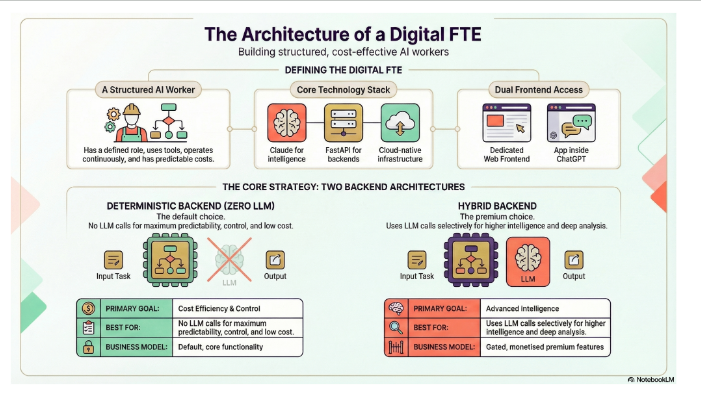

## The Architecture of a Digital FTE

Yeh exactly woh hai jo aap **Part 6-9: Agent Development** aur **Part 10-13: Scale & Monetize** mein build karte ho.

---

## DEFINING THE DIGITAL FTE (Top Section)

### 1. A Structured AI Worker 👷

**Book ka "Digital FTE Value Proposition" yahan implement hota hai:**

- **Defined role** - HR manager, SDR, Accountant (specific expertise)
- **Uses tools** - MCP integrations ke through CRM, databases access
- **Operates independently** - 24/7, no supervision needed
- **Interfaces with humans/systems** - APIs, webhooks, notifications

**Book se connection:**
> "A Digital FTE works 168 hours/week—24/7, no breaks, no vacations"

Yeh structured worker exactly wahi deliver karta hai.

### 2. Core Technology Stack (Center) ⚙️

**Teen foundational technologies jo book mein repeatedly mention hain:**

#### Claude for Intelligence 🧠
- **Book reference:** "Path A: General Agents (Claude Code)"
- Reasoning, decision-making, complex analysis
- Spec-driven development ka execution engine

#### FastAPI for Backends 🔧
- **Book reference:** "Part 6: AI Cloud Native Development"
- Lightweight, fast API framework
- MCP server implementations
- Webhook handlers

#### Cloud-native Infrastructure ☁️
- **Book reference:** "Pillar #9: Universal Cloud-Native Deployment"
- Docker containers
- Kubernetes orchestration
- Scalable, reliable infrastructure

**Why this stack?**
Book ke "Nine Pillars" mein yeh clearly defined hai - modern AI development ko yeh foundation chahiye.

### 3. Dual Frontend Access 📱💬

**Book ka "Distribution Breakthrough" yahan practical ban jata hai:**

#### Dedicated Web Frontend
- **Your own SaaS platform**
- Custom branding
- Full control
- Direct customer relationships
- Example: `your-digital-sdr.com`

#### Age inside ChatGPT
- **OpenAI Apps marketplace**
- 800M+ potential users
- Zero marketing cost initially
- Single-click adoption
- Instant distribution

**Book quote:**
> "The OpenAI Apps marketplace changes distribution: 800+ million users already on the platform"

Yeh dual access **maximum reach** ensure karta hai.

---

## THE CORE STRATEGY: TWO BACKEND ARCHITECTURES

Yeh section image ka **heart** hai aur book ke **"Radical Cost Discipline"** principle ko technically implement karta hai.

---

### DETERMINISTIC BACKEND (ZERO LLM) - Left Side 🔲

**"No LLM calls for maximum predictability, control, and low cost"**

#### Flow Diagram:
```
Input Task → Process (Gears/Rules) → ❌ No LLM → Output
```

**Cross mark (❌) LLM pe** = Deliberately avoid kar rahe hain

#### Three Key Aspects:

**🎯 PRIMARY GOAL: Cost Efficiency & Control**
- Predictable costs (no per-request API fees)
- Complete control over logic
- Auditable, certifiable (compliance needs)

**✅ BEST FOR: High-volume, standardized tasks**
- Data entry and validation
- Rule-based decisions
- Template generation
- CRM updates
- Workflow triggers
- Report generation

**📊 BUSINESS MODEL: Default, core functionality**
- Base subscription price ($500-800/mo)
- Unlimited usage without variable costs
- Foundation for all customers

#### Book Connection:

**Part 3: SDD-RI Fundamentals** teaches:
- Specification-Driven Development
- Rules and logic ko clearly define karna
- Deterministic outputs ensure karna

**Example - Digital SDR (Zero LLM tasks):**
```python
# Input validation (Zero LLM)
if email_format_valid(lead.email):
    lead.status = "qualified"
    
# Template selection (Zero LLM)
template = get_template(lead.industry, lead.size)

# CRM update (Zero LLM)
crm.update_lead(lead.id, status="contacted")
```

**Cost for 1000 leads:** ~$5 (infrastructure only)

---

### HYBRID BACKEND - Right Side 🌸⚙️

**"Uses LLM calls selectively for higher intelligence and deep analysis"**

#### Flow Diagram:
```
Input Task → Process → ✅ Strategic LLM → Output
```

**Check mark (✅) on LLM** = Deliberately use kar rahe hain jahan zaroori

#### Three Key Aspects:

**🎯 PRIMARY GOAL: Advanced Intelligence**
- Nuanced understanding
- Context synthesis
- Creative problem-solving
- Deep analysis

**✅ BEST FOR: Complex, high-value tasks**
- Sentiment analysis
- Multi-source data synthesis
- Personalized content generation
- Complex decision-making
- Pattern recognition in unstructured data

**📊 BUSINESS MODEL: Gated, monetised premium features**
- Premium tier pricing ($1,500-2,000/mo)
- Feature-gated access
- Higher value justifies higher cost

#### Book Connection:

**Part 5: Building Custom Agents** teaches:
- Agent SDKs (OpenAI, Claude, Google ADK)
- When to use AI reasoning
- How to optimize LLM calls

**Example - Digital SDR (Hybrid tasks):**
```python
# Complex lead scoring (Hybrid LLM)
analysis = claude.analyze(
    lead_data=lead.full_profile,
    company_signals=lead.company_events,
    conversation_history=lead.interactions
)
lead.score = analysis.score
lead.insights = analysis.key_points

# Personalized email (Hybrid LLM)
email = claude.generate(
    template=base_template,
    personalization={
        "pain_points": analysis.pain_points,
        "tone": lead.communication_style
    }
)
```

**Cost for 50 complex analyses:** ~$25/day = $750/month

---

## Economic Comparison (Book Ke Table Ka Implementation)

### Scenario: Digital SDR handling 1000 leads/month

**Zero LLM Approach (Basic Tier):**
```
Tasks:
- Email validation (1000 leads)
- Template assignment (1000 leads)  
- CRM updates (1000 leads)
- Follow-up scheduling (1000 leads)

Cost: ~$50/month (infrastructure)
Pricing: $500/month
Margin: $450/month ✅
```

**Hybrid Approach (Premium Tier):**
```
Tasks:
- All above (Zero LLM) → $50
- Lead scoring (200 complex) → $300
- Personalized emails (200) → $400
- Sentiment analysis (100) → $200

Cost: ~$950/month
Pricing: $1,500/month
Margin: $550/month ✅
```

**Wrong Approach (Full LLM for everything):**
```
Tasks:
- Everything through LLM → $15,000/month

Cost: $15,000/month
Pricing: $1,500/month  
Margin: -$13,500/month ❌ BANKRUPT!
```

---

## Business Model Integration

Image mein jo dono backends dikhaye gaye hain, woh **book ke monetization strategy** ko enable karte hain:

### Tiered Pricing Model:

**Basic Plan ($500/mo) - Zero LLM**
- Core functionality
- Unlimited volume
- Predictable performance
- Perfect for cost-conscious customers

**Pro Plan ($1,500/mo) - Hybrid Backend Unlocked**
- All basic features
- + AI-powered scoring
- + Personalized generation
- + Deep analysis
- Perfect for customers needing edge

**Enterprise Plan ($5,000/mo) - Full Customization**
- Custom LLM usage patterns
- Dedicated infrastructure
- White-label options
- SLA guarantees

---

## Technical Architecture Decisions (Book Ke "Nine Pillars")

### Pillar #1: AI CLI & Coding Agents
- Claude Code builds both backends
- Specifications drive implementation

### Pillar #3: MCP Standard
- Uniform tool integration
- Both backends use same MCP servers
- CRM, Email, Database connections

### Pillar #6: Test-Driven Development
- Zero LLM: Unit tests ensure correctness
- Hybrid LLM: Golden dataset validation (97%+ accuracy)

### Pillar #7: Spec-Driven Development
**Example spec:**
```markdown
## Feature: Lead Qualification

### Zero LLM Requirements:
- Email format validation
- Company size categorization
- Industry tagging

### Hybrid LLM Requirements (Premium):
- Buying intent scoring (0-100)
- Personality style detection
- Custom pitch generation
```

### Pillar #9: Cloud-Native Deployment
- Both backends containerized
- Kubernetes scaling
- Load balancing between tiers

---

## Real-World Implementation Path

**Book ka journey jo aap follow karte ho:**

### Phase 1: Start with Zero LLM (Parts 1-5)
```
Week 1-4: Build deterministic backend
- Learn FastAPI
- Implement MCP integrations
- Write specs for core workflows
- Deploy on cloud

Result: Basic Digital FTE working
```

### Phase 2: Add Hybrid Layer (Parts 6-9)
```
Week 5-8: Integrate selective LLM usage
- Identify high-value use cases
- Implement Claude SDK calls
- Create gating mechanism
- Test with golden dataset

Result: Premium features ready
```

### Phase 3: Launch Dual Frontend (Parts 10-13)
```
Week 9-12: Distribution strategy
- Build web frontend
- Create ChatGPT plugin
- Set up billing (tiered)
- Monitor usage and costs

Result: Sellable product with dual channels
```

---

## The Competitive Advantage

**Book ke "Competitive Reality" section se:**

### Your Architecture Advantages:

1. **Cost Predictability**
   - Zero LLM baseline = no cost surprises
   - Scale customers without scaling costs linearly

2. **Quality Consistency**
   - Deterministic logic = reliable outputs
   - LLM only jahan necessary = fewer errors

3. **Flexible Monetization**
   - Clear value tiers
   - Customers choose based on needs
   - Upsell path naturally clear

4. **Operational Efficiency**
   - Same core logic, different presentation
   - Deploy once, distribute everywhere
   - Update centrally, propagate automatically

### Competitors Without This Architecture:

- ❌ Unpredictable costs → Can't price competitively
- ❌ Full LLM reliance → Quality inconsistency
- ❌ No tiering → Leave money on table
- ❌ Platform lock-in → Limited distribution

---

## Critical Success Factors (Book Se)

### 1. Specification Clarity
**Book quote:**
> "Your success depends on how well you can describe problems to intelligent systems"

Dono backends ke liye **crystal-clear specs** chahiye:
- Zero LLM: Deterministic rules fully defined
- Hybrid LLM: Context, constraints, success criteria

### 2. Economic Discipline
**Book principle:**
> "Radical cost discipline"

Har feature ke liye poocho:
- "Yeh Zero LLM se ho sakta hai?"
- "LLM ka ROI justify hota hai?"
- "Customer iske liye pay karega?"

### 3. Testing Rigor
**Book requirement:**
> "Golden Dataset of 50+ scenarios, 97%+ accuracy"

Dono backends test karo:
- Zero LLM: Deterministic tests (100% pass)
- Hybrid LLM: Evaluation dataset (97%+ accuracy)

---

## The Ultimate Picture

Yeh image **book ka technical manifestation** hai:

**From concept (Part 1) → To sellable product (Part 13)**

**Every element connected:**
- Structured worker = Digital FTE definition
- Tech stack = Modern AI development pillars
- Two backends = Radical cost discipline
- Dual frontend = Distribution breakthrough
- Business model = Four monetization paths

**Book ka promise:**
> "Build AI agents that capture YOUR expertise and monetize them as Digital FTEs"

Yeh architecture **exactly wahi deliver karta hai** - ek complete, production-ready system jo:
- ✅ Intelligent hai (Hybrid backend)
- ✅ Cost-effective hai (Zero LLM baseline)
- ✅ Scalable hai (Cloud-native)
- ✅ Distributable hai (Dual frontend)
- ✅ **Profitable hai** (Tiered pricing with healthy margins)
