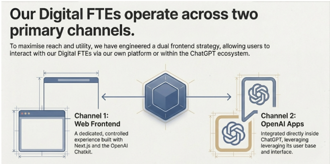

## 🧩 Image ka Main Idea (Book ke mutabiq)

**Digital FTEs do main channels par kaam karte hain**
taake:

* zyada logon tak pohanch ho
* aur enterprise ko flexibility mile

Book isay **dual-frontend strategy** kehti hai.

---

## 🔀 Do Primary Channels ka Matlab

### 🖥️ Channel 1: Web Frontend (Apni Platform)

Is side par:

* Aap apni **khud ki website / app** banate ho
* Next.js jaisa framework use hota hai
* OpenAI Chatkit se AI connect hota hai

📌 Book ke mutabiq:

* Yeh **controlled environment** hota hai
* Enterprise ko custom workflows milte hain
* Security aur branding aap ke haath mein hoti hai

👉 Jaise company ke liye **private office setup**

---

### 🤖 Channel 2: OpenAI Apps (ChatGPT Ecosystem)

Is side par:

* Digital FTE **direct ChatGPT ke andar** available hota hai
* User ko nayi app seekhne ki zaroorat nahi
* Woh jahan pehle se kaam kar raha hota hai, wahin agent mil jata hai

📌 Book ke mutabiq:

* Yeh **global distribution channel** hai
* Millions of users + businesses already wahan hain
* One-click “hire” concept possible hota hai

👉 Jaise **public marketplace / App Store**

---

## 🎯 Dono Channels Kyun Zaroori Hain? (Book ka Logic)

Book kehti hai:

> Sirf ek channel se global dominance possible nahi

Is liye:

* **Web Frontend** → deep enterprise control
* **OpenAI Apps** → massive global reach

👉 Dono mil kar:

* Product ka adoption fast kar dete hain
* Sales cycle choti kar dete hain
* Scaling easy ho jati hai

---

## 🧠 Center Box ka Matlab (Digital FTE Core)

Image ke beech ka cube:

* **Actual Digital FTE brain** ko represent karta hai

Matlab:

* Same AI agent
* Same skills
* Same intelligence

Bas:

* Do jagah se access ho raha hai

👉 Book isay kehti hai:
**“Build once, deploy everywhere”**

---

## 🌟 Book ka Final Message (Image Summary)

* Digital FTE sirf app nahi
* Yeh **AI employee** hai

Aur AI employee:

* Company ke office (Web App) mein bhi kaam kare
* Aur global marketplace (ChatGPT) mein bhi

🦄 Isi dual-channel strategy se:

* Small team
* Massive reach
* Unicorn AI startup possible hota hai