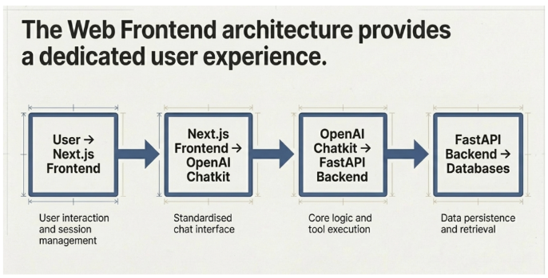

## 🖥️ Web Frontend Architecture (Book ke mutabiq)

### 📌 Image ka Main Message

Book kehti hai:

> Enterprise ko **Chat experience se zyada**
> **proper, controlled user experience** chahiye

Is liye yeh **dedicated Web Frontend architecture** use hoti hai.

---

## 🔗 Step-by-Step Flow (Left → Right)

### 1️⃣ **User → Next.js Frontend**

Yahan:

* User website open karta hai
* Login, session, dashboard, buttons waghera handle hote hain

📌 Book ke mutabiq:

* Next.js **enterprise-grade UI** deta hai
* Security + session control strong hota hai

👉 Jaise employee ka **proper office desk**

---

### 2️⃣ **Next.js Frontend → OpenAI Chatkit**

Is step mein:

* Chat ka experience **standardised** hota hai
* User aur AI ke darmiyan clean interface banta hai

📌 Book ke mutabiq:

* Chatkit AI interaction ko **reliable aur consistent** banata hai
* Enterprise ke liye controlled conversation flow hota hai

👉 Jaise company ka **official communication system**

---

### 3️⃣ **OpenAI Chatkit → FastAPI Backend**

Yahan real kaam hota hai:

* AI agent logic chalta hai
* Tools call hotay hain
* Decisions liye jate hain

📌 Book ke mutabiq:

* FastAPI agent ka **brain + hands** hai
* Yahin Digital FTE ka actual kaam hota hai

👉 Jaise employee ka **dimagh aur skills**

---

### 4️⃣ **FastAPI Backend → Databases**

Is step mein:

* Data save hota hai
* History, logs, files retrieve hoti hain

📌 Book ke mutabiq:

* Enterprise ke liye **data persistence** bohot zaroori hai
* Har company ka data alag aur secure hota hai

👉 Jaise company ka **record room**

---

## 🧠 Book ka Core Idea (Is Image ka Summary)

Book yeh samjhati hai:

* Digital FTE sirf chat bot nahi
* Yeh **proper enterprise system ka hissa** hota hai

Is architecture se:

* Security milti hai
* Control milta hai
* Scale possible hota hai

---

## 🌟 One-Line Book Summary

> Web Frontend architecture Digital FTE ko
> **real enterprise employee** banata hai,
> sirf chat toy nahi.
