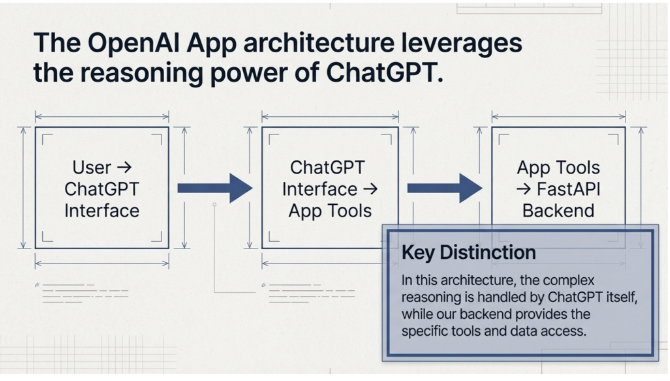

Is image ko Agent Factory book ke context mein dekhein to yeh **OpenAI ke ChatGPT ki fundamental architecture pattern** ko dikhata hai jo agentic application ki misaal hai.

## Teen Layer Architecture

Diagram mein dikhaya gaya hai ke ChatGPT kaise ek agent system ki tarah kaam karta hai:

1. **User → ChatGPT Interface**: User ek conversational interface ke zariye interact karta hai jahan wo apni zaroorat natural language mein batata hai.

2. **ChatGPT Interface → App Tools**: ChatGPT reasoning engine ki tarah kaam karta hai jo user ki intent ko samajhta hai aur decide karta hai ke kaunse tools use karne hain. Yeh system ka "dimagh" hai.

3. **App Tools → OpenAI API Backend**: Backend specialized capabilities provide karta hai jaise web search, code execution, file access, aur doosre tools jo ChatGPT orchestrate kar sakta hai.

## Key Distinction (Ahm Farq)

Callout box mein highlight kiya gaya hai ke is ko "agentic" kya banata hai, sirf chatbot nahi:

**ChatGPT complex reasoning handle karta hai** - Yeh determine karta hai ke user kya chahta hai, complex tasks ko breakdown karta hai, decide karta hai ke kaunse tools invoke karne hain, aur kis sequence mein.

**Backend specific tools aur data access provide karta hai** - Business logic ko hard-code karne ki bajaye, system aise capabilities provide karta hai jo AI agent flexibly combine kar sakta hai.

## Agent Factory Concepts ke saath Connection

Yeh book ke **agent-native development** ke emphasis ke saath align karta hai, jahan:
- LLM central reasoning component hai, sirf ek feature nahi
- Tools aur APIs building blocks ban jate hain jo agent orchestrate karta hai
- Architecture flexible, multi-step problem-solving enable karta hai predetermined workflows ki bajaye

Yeh pattern traditional software se shift dikhata hai jahan developers har decision path code karte thay, agentic systems ki taraf jahan AI dynamically solution approach determine karta hai user needs ke basis par.