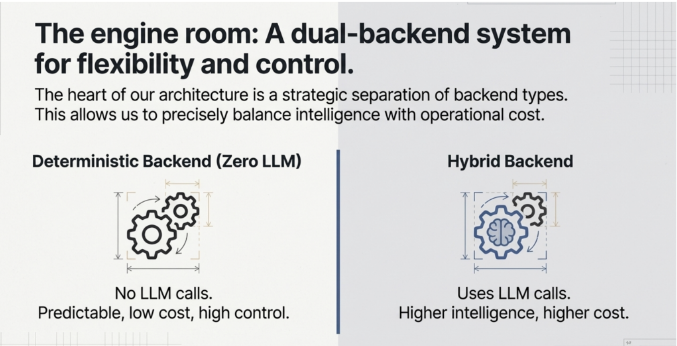

Is image ko Agent Factory book ke context mein samjhein:

## The Engine Room: Dual-Backend System

Yeh diagram **strategic architecture pattern** dikhata hai jo flexibility aur control ke liye **do alag backend types** use karta hai.

### Architecture ka Dil (Heart)

Book kehti hai ke backend types ko **strategically separate** karna zaroori hai taake hum **intelligence aur operational cost ko precisely balance** kar sakein.

## Do Backend Types:

### 1. **Deterministic Backend (Zero LLM)**
- **Koi LLM calls nahi**: Yeh traditional code-based backend hai
- **Predictable**: Har baar same input pe same output
- **Low cost**: LLM API calls nahi to kharcha kam
- **High control**: Developer ke paas poora control hai ke kya hoga

**Kab use karein**: Jab task simple, well-defined, aur predictable ho. Jaise data validation, simple calculations, database queries.

### 2. **Hybrid Backend**
- **LLM calls use karta hai**: AI reasoning integrate hai
- **Higher intelligence**: Complex problems solve kar sakta hai, decisions le sakta hai
- **Higher cost**: LLM API calls ki wajah se zyada kharcha
- **Flexible**: Dynamic situations handle kar sakta hai

**Kab use karein**: Jab reasoning chahiye, complex decision-making ho, ya natural language understanding zaroori ho.

## Agent Factory ka Core Principle

Book yeh emphasize karti hai ke **har kaam ke liye LLM use karna zaroori nahi**. Smart architecture mein:

- Simple, predictable tasks → Deterministic backend (fast aur sasta)
- Complex, reasoning-required tasks → Hybrid backend (intelligent par mehnga)

Yeh approach **cost-effective aur performant** systems banane mein madad karta hai, jahan intelligence sirf wahan use hoti hai jahan waqai zaroori hai.