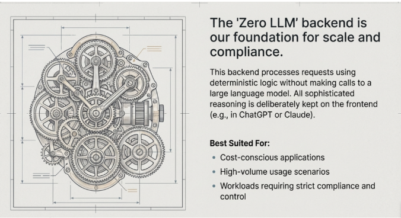

## "Zero LLM" Backend Architecture - Kya Hai?

Yeh image ek **deterministic processing engine** dikhata hai jo gears (machinery) ki tarah kaam karta hai. Yeh Agent Factory framework ka bohot important concept hai.

### Do Layers Ka System

Agent Factory approach mein **do alag architectural layers** hain:

1. **Frontend (Soch wali layer)** - Jahan Claude ya ChatGPT jaise AI models sophisticated reasoning karte hain, natural language samajhte hain
2. **Backend (Execution layer)** - Yeh "Zero LLM" system jo aapki image mein hai, jo **bilkul deterministic logic** se kaam karta hai - koi AI call nahi

### Digital FTEs Ke Liye Yeh Kyun Zaroori Hai?

Book mein **sellable, reliable products** banana sikhaya jata hai. Zero LLM backend yeh fayde deta hai:

- **Cost predictable rahti hai** - Backend operations ke liye koi LLM API fees nahi lagti
- **Compliance guarantee milti hai** - Deterministic behavior jo aap audit kar sakte hain
- **High-volume handle kar sakta hai** - Hazaron transactions process karo bina variable AI costs ke
- **Puri control rahti hai** - Har operation defined business rules follow karta hai

### Practical Example

Book mein jo **Digital SDR** (Sales Development Rep) ka example diya gaya hai, wahan:

- **Frontend (AI wali layer)**: Claude leads ke saath conversation karta hai, qualify karta hai, personalized responses deta hai
- **Backend (Zero LLM - yeh gears)**: CRM update karta hai, workflow route karta hai, compliance check karta hai - **sab deterministic**

### Architecture Ka Logic

Yeh design pattern book ke **"Specifications as Living Contracts"** principle ko follow karta hai:

- **Gears = Business rules** jo exactly waise execute hote hain jaise likhe gaye hain
- **Connectors = MCP integrations** jo CRM, databases, APIs se connect karte hain
- **Deterministic flow = Enterprise-grade reliability** jo customers ko chahiye

### Best Suited For (Jaise Image Mein Likha Hai):

1. **Cost-conscious applications** - Jahan paise bachane zaroori hain
2. **High-volume scenarios** - Jahan bohot zyada requests handle karni hain
3. **Strict compliance** - Jahan har step documented aur predictable hona chahiye (legal, finance, healthcare)

### Key Takeaway

Sophisticated thinking (reasoning) AI par chhodo, lekin reliable execution deterministic backend par karo. Yeh combination hi **monetizable Digital FTEs** banata hai jo enterprises buy kar sakti hain.

Yeh woh architecture hai jo book mein sikhaya ja raha hai - jahan AI ki power aur traditional software ki reliability mil kar **sellable products** banti hain.