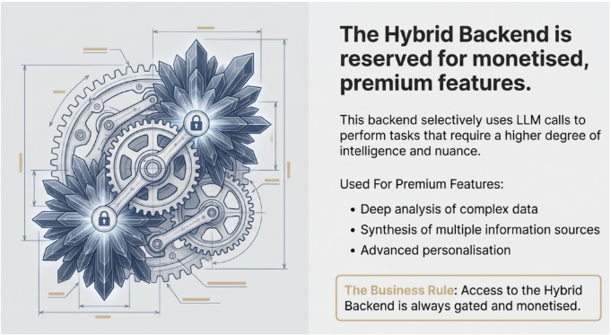

## Hybrid Backend - Premium Features Ke Liye

Yeh image mein gears ke saath **phool ki pattiyan** (decorative elements) dikhaye gaye hain - yeh represent karta hai ke yeh backend **deterministic logic AUR AI intelligence dono use karta hai**.

### Teen Backend Strategies (Book Ke Mutabiq)

Agent Factory approach mein **teen tarah ke backends** hain:

1. **Zero LLM Backend** (Pehli wali image) - Sirf deterministic, bilkul AI nahi
2. **Hybrid Backend** (Yeh wali image) - AI aur deterministic ka combination
3. **Full AI Backend** - Har jagah AI use karna

### Hybrid Backend Kab Use Hota Hai?

Image mein jo likha hai, woh book ke **monetization strategy** se directly connect hota hai:

**"Monetised, Premium Features"** - Matlab:

- **Basic features** → Zero LLM backend (sasta, fast, reliable)
- **Premium features** → Hybrid backend (AI ki intelligence add karo)

### Premium Features Ki Examples (Image Se):

1. **Deep analysis of complex data** 
   - Example: Customer behavior patterns analyze karna
   - AI yahaan context samajhta hai, patterns dhoondhta hai

2. **Synthesis of multiple information sources**
   - Example: CRM + Email + Social media ka data combine karke insights nikalna
   - AI yahaan sources ko intelligently merge karta hai

3. **Advanced personalisation**
   - Example: Har client ke liye unique, tailored recommendations
   - AI yahaan nuance aur tone customize karta hai

### Book Ke Business Model Se Connection

Book mein **Four Ways to Monetize Digital FTEs** bataye gaye hain. Hybrid Backend iss strategy ko enable karta hai:

**Tiered Pricing Model:**
- **Basic Plan ($500/month)** → Zero LLM backend use kare, simple tasks
- **Premium Plan ($2000/month)** → Hybrid backend unlock ho, AI-powered features mile

### The Business Rule (Image Mein Highlight Hai)

**"Access to the Hybrid Backend is always gated and monetised"**

Matlab:
- Yeh features **free nahi diye jate**
- Customers ko **pay karna hoga** advanced intelligence ke liye
- Yeh **recurring revenue** ka source hai

### Practical Example - Digital SDR (Book Se)

**Basic Tier (Zero LLM):**
- Lead ko acknowledge karo
- Simple qualification questions poocho
- CRM mein data enter karo

**Premium Tier (Hybrid Backend):**
- Complex buying signals analyze karo (AI use karke)
- Multiple conversation sources se intent samjho (AI synthesis)
- Har prospect ke liye personalized pitch likho (AI personalization)

### Architecture Ki Samajh

Image mein **phool ki pattiyan** = AI ki intelligence (beautiful, sophisticated)
**Gears** = Deterministic logic (reliable, structured)

Dono ka combination = **Premium experience** jo customers pay karenge

### Cost Management Strategy

Book mein **Digital FTE Value Proposition** table hai jisme costs breakdown diye gaye hain. Hybrid approach se:

- **90% tasks** → Zero LLM backend (cheap, predictable cost)
- **10% premium tasks** → LLM calls (higher cost, higher value)

Isse overall **margins protect** hote hain while **premium features sell** kar sakte ho.

### Key Takeaway (Book Ke Framework Mein)

Yeh **Path B: Custom Agents (The Product)** ka practical implementation hai:

1. Core functionality deterministic rakho (reliable + cheap)
2. Premium intelligence AI se do (valuable + monetizable)
3. Access **gated** rakho (recurring revenue)

Yeh exactly woh strategy hai jo book mein **"Building Sellable Digital FTEs"** section mein teach ki gayi hai - jahan aap **margins maintain karte ho** lekin **premium value bhi deliver karte ho**.

**Bottom line**: Zero LLM se foundation banao, Hybrid se premium features becho, aur enterprises ko tiered pricing do. Yahi sustainable Digital FTE business model hai! 💰